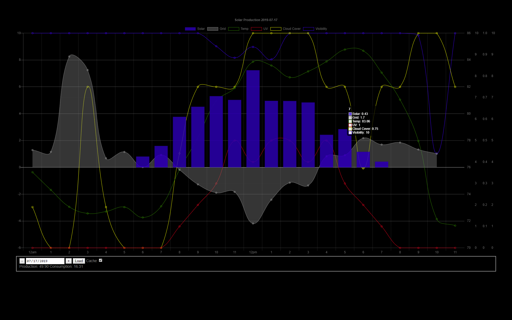
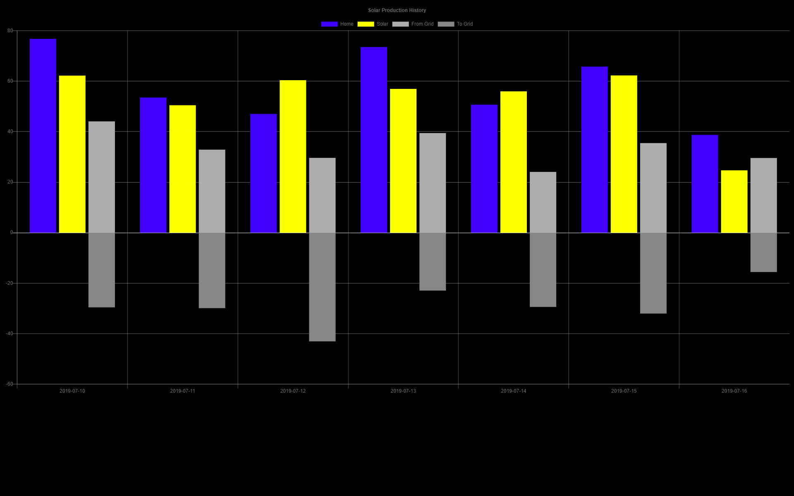

# Tesla Solar Energy Monitor Charts and Proxy Web Server
> Web Proxy Server writen in NodeJS to view, host, and cache data for Tesla Solar Energy Monitor Web Page Charts.
### Note: Tesla is shuting Down the Solar City PowerGuide web site August 1, 2019. In order to archive your history you will need to use this app before then.
### Currently Tesla is only supporting the Phone App, which has limited history. 
#### Currently Tesla and only sending data from the beginging of yesterday 12am, so in order to keep your current data, you will need to use this app to cache. 

[github]
# featchers
* Shows Hourly Stats for Solar, Grid and weather (Temprature, UV, Cloud Cover, Visabilty).
* Realtime Page for Solar, Grid, Home
* History by Week (to do: Year, Month)
* Solar City Hourly, Legacy (as ofAugust 2019)
* Proxy Server Handles Authentication and Cross-Origin Resource Sharing (CORS)
* works with DarkSky for weather. Get free API key here: https://darksky.net/dev
* Caches all data both client and server side for performance and archiving history and minimise trafic to Tesla Web Server.
* Scripts to help ScheduledTask automate downloading of your data. See TeslaGetData.js and SolarCityGetData.js in misc folder
* minimal dependencies and javascript code in both nodejs server and client brower
* uses Charts.js via CDN https://www.chartjs.org/ [](https://www.jsdelivr.com/package/npm/chart.js) 
* more comming soon.

Day

Week


## Installation

For all OSs supported by NodeJS (Linux/RaspberryPi/Mac/Windows/etc...):


1. install the lastest NodeJS [nodejs] (10.16.0 LTS is fine)
2. extract or git clone the source code here: [github]
3. (optionaly to show weather) register for a free DarkSky API key here: (darksky.net/dev)
4. save your DarkSkyID in private/darkskyconfig.json formated:  (optional) get your Lat/long http://ip-api.com/json
```
     { "DarkSkyID": "0123456789abcdef9876543210fedcba", "Lat": 41.71, "Long": -81 }
```

## Usage

1. open a command shell and cd into the projects folder
2. ```
     node misc\login.js email password
2. ```
    node proxyserver.js [port] (default is 3000)
3. Open the url http://localhost:3000 in a modern brower (Chrome, FireFox, Chromium)
4. To Autorize to the Solar City web service go to your mysolarcity.com [powerguide](https://mysolarcity.com/#/monitoring/historical/day) and click the top right corner share link button and cut and paste the share url and past it in the main page and click the authorize button 


## Release History

* 0.0.1 2019-07-17
    *  Intial Release

## Meta

Mike Horgan – [GitHub] – bitjunky@hotmail.com

Distributed under the MIT license. (LICENCE.txt)

[https://github.com/GigaJunky/](https://github.com/GigaJunky/)

<!-- Markdown link & img dfn's -->
[github]: https://github.com/gigajunky
[nodejs]: https://nodejs.org
[darksky]: https://darksky.net/dev